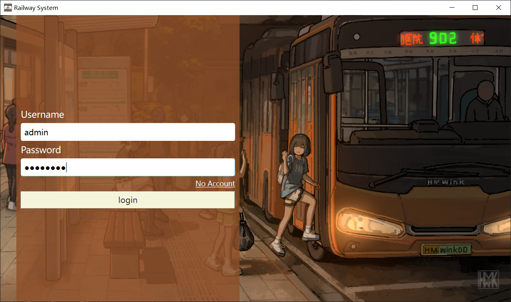
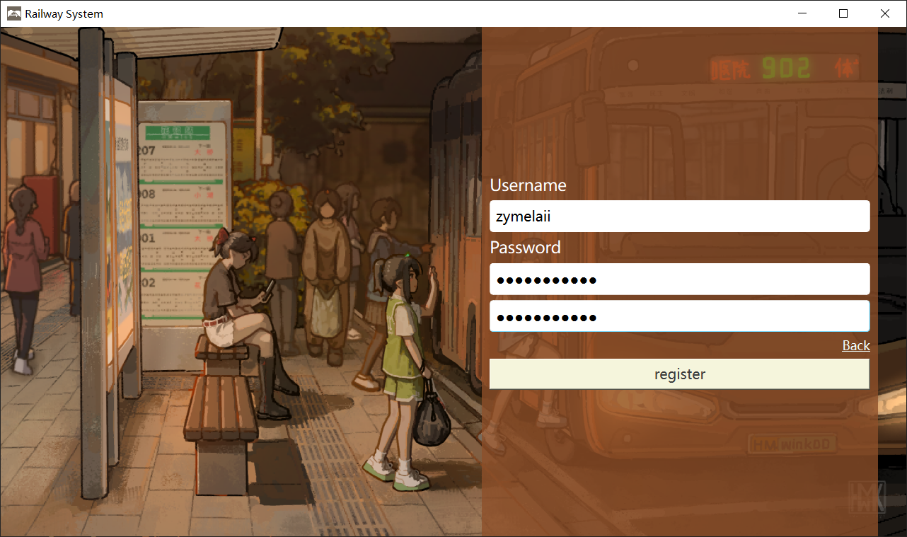
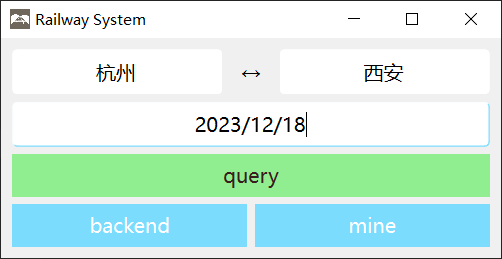
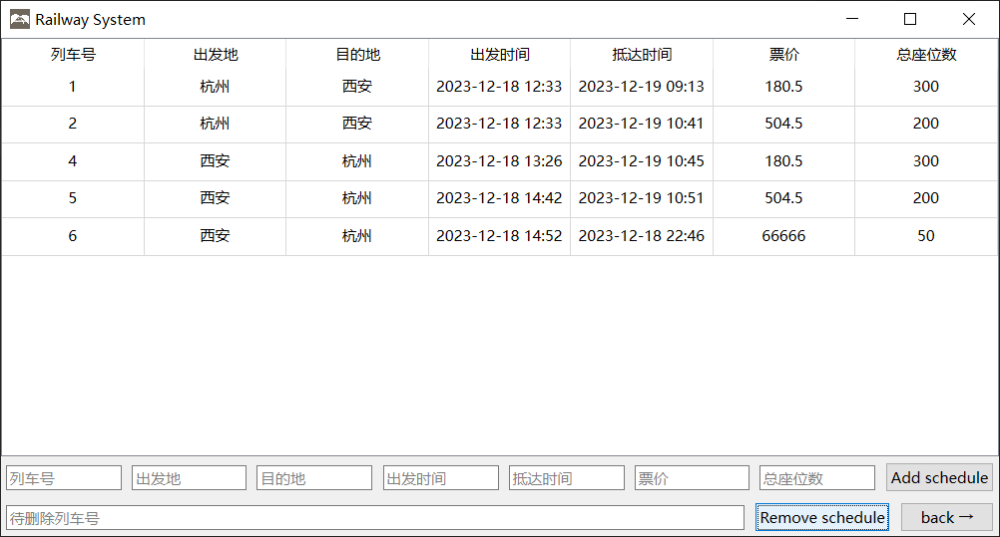
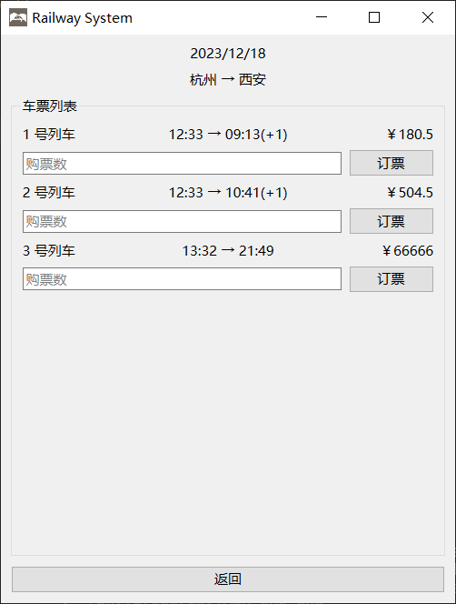
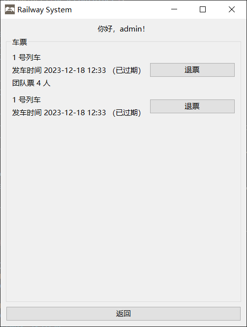

# fake-railway-sys

A fake railway management system written with Qt6 for database course experiment.

> very very poor 😭😭😭

## Screenshots

Well, it's over...
---

> **`AGAIN`**
>
> very very poor 😭😭😭
